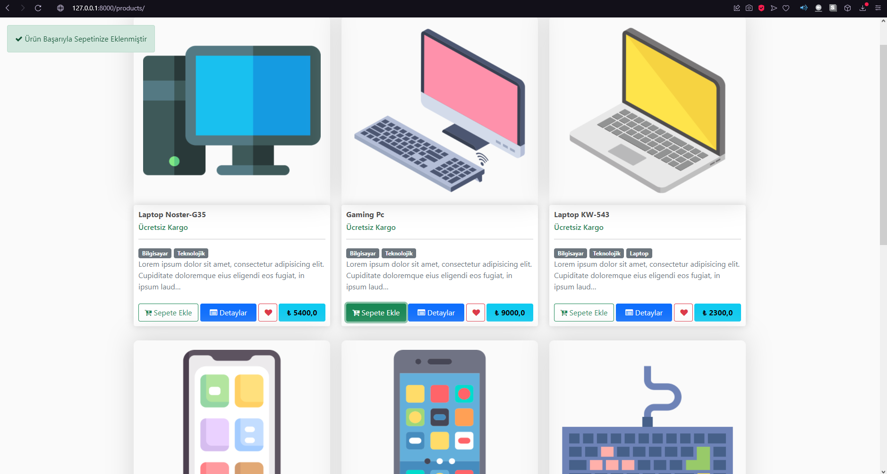
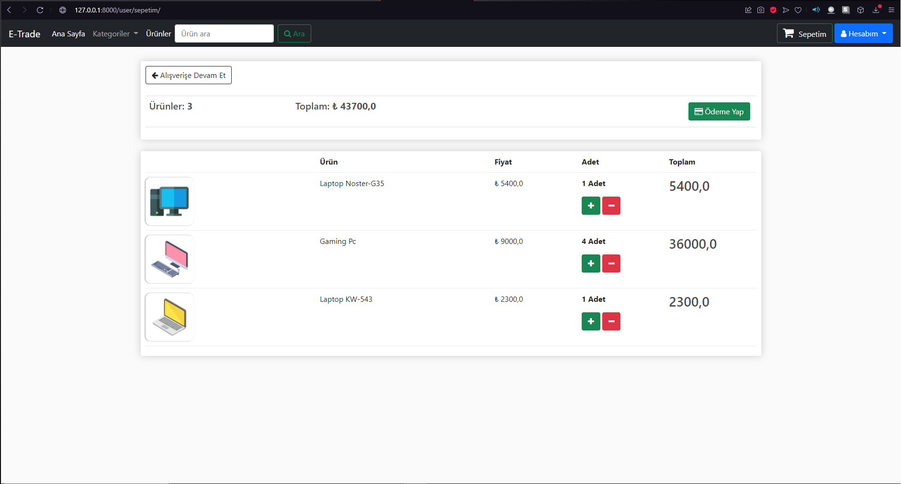
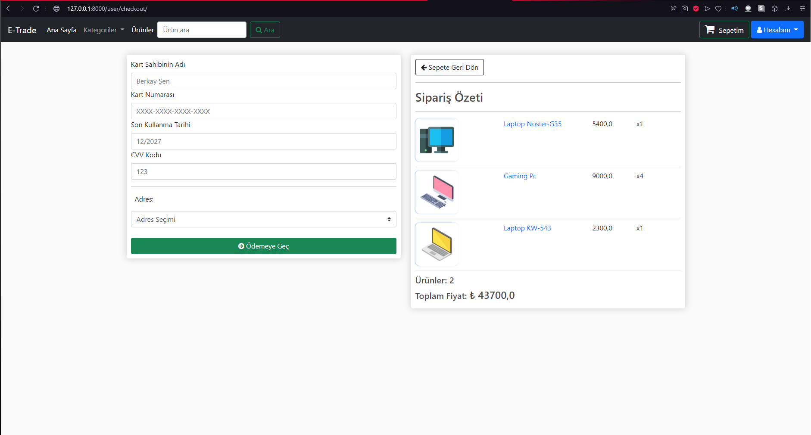
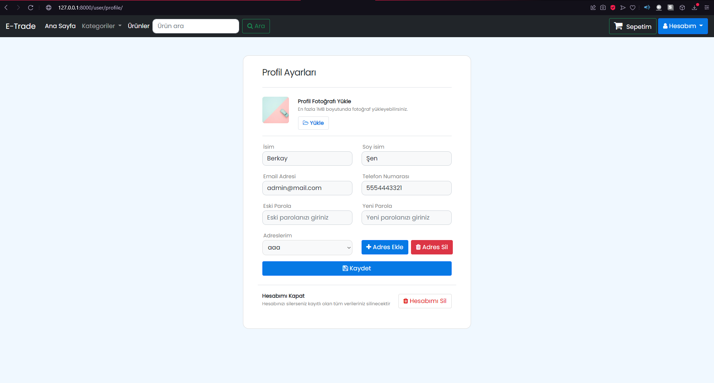

 

  

  <h3 align="center">Python Django ile E Ticaret Sistemi</h3>

  

    E Trade System
     
     
    
<address>
      

    <a href="mailto:brktrl@protonmail.ch">Hata Bildir</a>
     
    

    </address>
    

  

  
<h2 style="display: inline-block">Hakkında</h2>

  <ol>
    <li>
      <a href="#Program-Hakkında">Program Hakkında</a>
      <ul>
        <li><a href="#Ne-İle-Geliştirildi">Ne İle Geliştirildi</a></li>
      </ul>
    </li>
    <li>
      <a href="#Başlangıç">Başlangıç</a> 
    </li>
    <li><a href="#Kullanım">Kullanış</a></li>
    <li><a href="#Görseller">Örnek Resimler</a>
    <li><a href="#lisans">Lisans</a></li>
    <li><a href="#Iletisim">İletişim</a></li>
  </ol>

## Program-Hakkında

**Klasik bir e ticaret sisteminde temel olan tüm opsiyonları Python'un django kütüphanesi ile geliştirilmiş olup sistemlere özgü bir şekilde kullanılması amaçlanmıştır.Sadece bir veritabanına bağlı kalmayıp tek kod değişikliği ile tüm veritabanlarına geçiş yapılabilir.
Özellikleri ise:
Sepet Sistemi,
Sipariş Sistemi,
Ürün ve ürün yorum sistemi,
Kullanıcı Sistemi (Giriş-Kayıt-Profil Ayarları vb.)
AJAX ile sürekli render almadan ,sayfa yenilenmeden get ve POST istekleri.**

`BrktrLawliet`,
`brktrl@protonmail.ch`
`E Trade System With Python Django`

### Ne-İle-Geliştirildi

* [Python](https://www.python.org)
* [SQLite](https://www.sqlite.org/index.html)
* [Django](https://www.djangoproject.com)

## Başlangıç

## Kullanım

Manage.py dosyasının olduğu dizine geçtikten sonra `python manage.py runserver` komutunu çalıştırıp test edebilirsiniz.

## Desteklediği-İşletim-Sistemleri
* Tüm platformlar

## Görseller
Programın arayüzünden örnek görseller.
 
</img> 
</img> 
</img> 
</img> 
## lisans
Bu yazılım MIT Lisansı ile korunmaktadır. Daha fazla bilgi için `LICENSE` dosyasını okuyunuz.
 Copyright (c) 2021 

## Iletisim

E-Mail Adresi:E-Mail - brktrl@protonmail.ch

Proje Linki: [https://github.com/Brktrlw/Django-Etrade-System](https://github.com/Brktrlw/Django-Etrade-System) 

